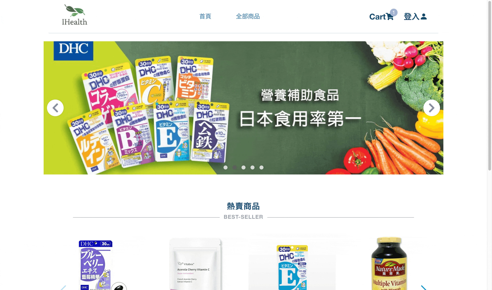
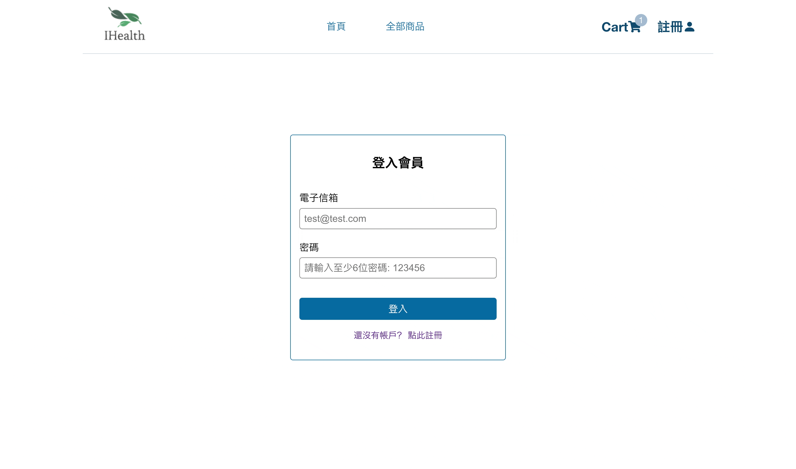
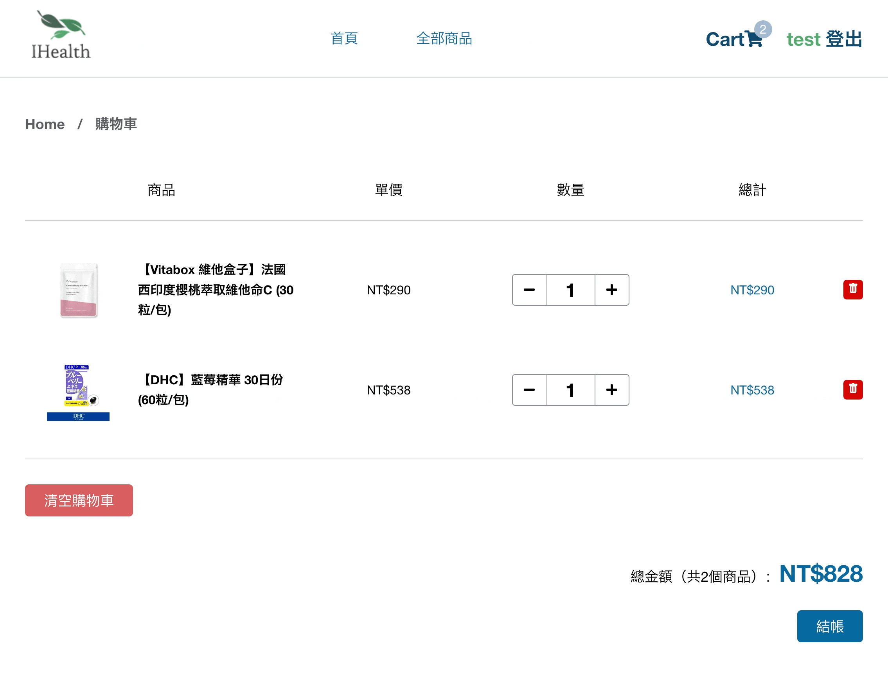

# IHealth | Supplement Ecommerce



IHealth 是一個販賣保健食品的購物網站，使用 react 框架，發佈在 firebase 上

demo網址: https://e-commerce-fea9f.web.app/

```
測試會員帳號
email: test@test.com
密碼：123456

信用卡測試號碼 : 4242 4242 4242 4242
```
<br/>

## 使用技術

<table>
  <thead>
    <tr>
      <th>技術</th>
      <th>功能</th>
    </tr>
  </thead>
  <tbody>
    <tr>
      <th>hooks</th>
      <td>使程式碼更簡短、易於理解和在組件間更有重複使用性</td>
    </tr>
    <tr>
      <th>context</th>
      <td>可以將資料傳到直接傳送到需要的元件，不用經過中間層層傳遞</td>
    </tr>
    <tr>
      <th>reducer</th>
      <td>使程式碼更整齊，把所有功能結合成一個函式，邏輯集中化</td>
    </tr>
    <tr>
      <th>localstorage</th>
      <td>將網頁中的資料儲存在使用者的瀏覽器當中，購物車紀錄得以被永久保存</td>
    </tr>
    <tr>
      <th>react router dom</th>
      <td> 實做單頁面應用程式(SPA)，讓使用者始終在同一個頁面，根據輸入的網址來呈現不同的網頁內容。網站不會重整，因此內容的切換更快速、更順暢，帶來更好的使用者體驗</td>
    </tr>
    <tr>
      <th>firebase</th>
      <td>使用 firebase deploy, firestore, authentication, stripe 金流 extention</td>
    </tr>
    <tr>
      <th>RWD</th>
      <td>能因應不同裝置螢幕大小而自動調整網頁圖文內容和排版，給使用者最佳瀏覽畫面</td>
    </tr>
    <tr>
      <th>styled component</th>
      <td>CSS-In-JS 的函式庫，使你可以在 JSX 中撰寫 CSS code</td>
    </tr>
  </tbody>
</table>

<br/>

## 網頁功能

### 商品搜尋、分類、篩選功能


### 購物車


### 會員


### 金流

